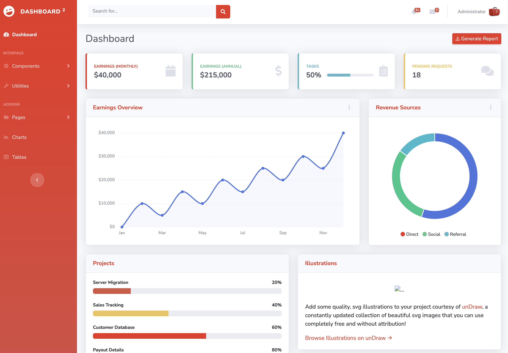

# Django - Dashboard with Django and Bootstrap

This Dnajgo Applications show how to implement multiple Apps with in a Djaogo App, using Bootstrap as CSS Framework.

The functionality is demonstrated using the Bootstrap Template [SB Admin 2](https://startbootstrap.com/theme/sb-admin-2)
